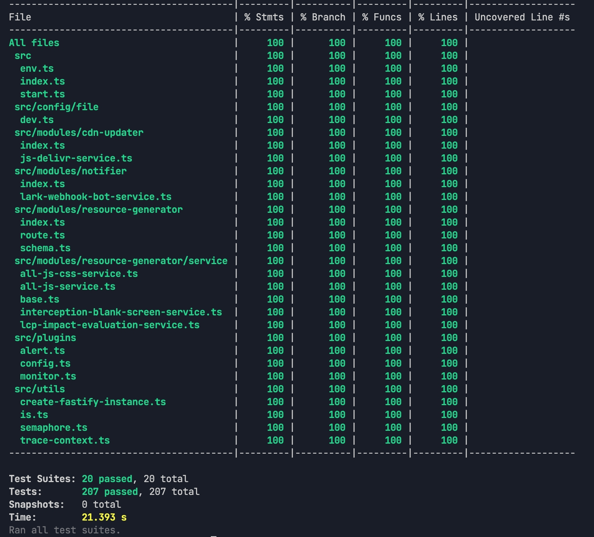

# Prefetcher

中文 | [English](../README.md)

基于 Fastify 和 TypeScript 的资源预取服务。捕获网页资源并生成关键资源列表，上传到 CDN 供其他站点 Prefetch 使用，以此来减少跳转至该页面的加载时间。

## 🎯 项目目的

通过以下方式帮助优化 Web 应用性能：

1. 使用 Puppeteer 分析网页，捕获加载的资源
2. 基于策略生成核心资源列表，并上传至CDN
3. 其他Web应用获取CDN资源，使用Prefetch预获取核心资源，减少跳转至该页面的加载时间

## 🚀 快速开始

### 前置要求

- Node.js >= 20
- pnpm >= 10
- 配置了 SSH 访问的 GitHub 仓库（用于上传资源）
- 飞书 webhook tokens（可选，用于通知）

### 安装
```bash
pnpm install
```
### 配置

#### 环境变量

```bash
# 指定 Chrome/Chromium 路径
export PUPPETEER_EXECUTABLE_PATH=/path/to/chrome

# 飞书 webhook tokens，用于发送各类通知（可选）
export LARK_BOT_TOKENS=token1,token2,token3
```

#### CDN 配置

在 `src/config/file/dev.ts` 中配置 CDN 设置：

```typescript
{
  port: 3000,
  cdn: {
    jsDelivr: {
      // 本地仓库存放路径，服务会将远程仓库拉取到这个路径
      localPath: "/path/to/local/repo",
      
      // 上传资源列表的仓库地址，请确保使用 SSH 地址，否则启动时需要登录
      remoteAddr: "git@github.com:user/repo.git",
      
      // Git 提交使用的 name 和 email
      git: {
        name: "Your Name",
        email: "your.email@example.com"
      }
    }
  }
}
```

> **⚠️ 注意：** 配置文件根据 `NODE_ENV` 环境变量读取。例如，配置生产环境时，可以创建 `prod.ts` 文件，并将 `NODE_ENV` 设置为 `prod`。具体逻辑见 `src/plugins/config.ts`。

### 运行

```bash
# 开发模式（自动重载）
pnpm dev

# 调试模式（可见浏览器窗口）
pnpm dev:debug

# 构建生产代码
pnpm build

# 指定环境（读取config/file下的配置文件）
NODE_ENV=your-env

# 启动服务
pnpm start
```

### Docker运行

```bash
# 构建镜像
./build.sh

# 启动容器
docker run -p 3000:3000 prefetcher
```

服务默认运行在 `http://localhost:3000`。

## 📖 使用方法

### API 接口

**POST** `/res_gen`

从指定 URL 捕获资源并部署到 CDN。

#### 请求参数

```json
{
  "targetUrl": "https://example.com",
  "projectName": "my-project",
  "targetFileName": "prefetch-list.json",
  "template": "window.__PREFETCH_RESOURCES__ = __content_placeholder__;",
  "notifications": ["lark-webhook-token-1"]
}
```

| 字段 | 类型 | 必填 | 说明 |
|------|------|------|------|
| `targetUrl` | string | 是 | 要分析的目标 URL。 |
| `projectName` | string | 是 | GitHub 分支名称（用于隔离不同项目的资源列表）。 |
| `targetFileName` | string | 是 | 输出文件名（例如 `prefetch-resources.js`）。 |
| `template` | string | 否 | 包含 `__content_placeholder__` 的模板。例如：`window.RESOURCES = __content_placeholder__;`。 |
| `notifications` | string[] | 否 | 部署完成后接收通知的飞书 Webhook Token 列表。 |

#### 响应

```json
{
  "url": "https://cdn.jsdelivr.net/gh/namespace/repo@branch/prefetch-list.json"
}
```

### 使用示例

```bash
curl -X POST http://localhost:3000/res_gen \
  -H "Content-Type: application/json" \
  -d '{
    "targetUrl": "https://example.com",
    "projectName": "production",
    "targetFileName": "resources.json"
  }'
```

## 🏗️ 项目结构

```
├── script/                   # 自动化测试与辅助脚本
├── src/
│   ├── modules/
│   │   ├── resource-generator/    # 使用 Puppeteer 捕获资源，并分析核心资源
│   │   ├── cdn-updater/           # 将资源上传至CDN，目前仅支持 GitHub + jsDelivr 部署
│   │   └── notifier/              # 发送通知，目前仅支持飞书 webhook 通知
│   ├── plugins/
│   │   ├── config.ts             # 配置管理
│   │   ├── monitor.ts            # Prometheus 指标
│   │   └── alert.ts              # 错误告警
│   ├── utils/                    # 工具函数
│   ├── config/file/              # 环境配置文件
│   ├── index.ts                  # CLI 入口
│   └── start.ts                  # 服务器启动
└── global.d.ts               # 全局类型定义
```

### 核心组件

**资源生成器** (`src/modules/resource-generator/`)
- 使用 Puppeteer 拦截网络请求
- 跟踪资源大小和加载时间
- 过滤和排序核心资源

**CDN 更新器** (`src/modules/cdn-updater/`)
- 管理 Git 操作（克隆、提交、推送）
- 更新后清除 jsDelivr 缓存
- 验证内容部署

**通知器** (`src/modules/notifier/`)
- 向飞书 webhook 发送消息
- 失败请求重试，支持指数退避策略
- 支持多个 webhook tokens

## 📋 资源捕获策略

由于现代 Web 应用（如 React/Vue）广泛采用路由懒加载（Lazy Loading）和动态导入（Dynamic Import），仅监听 `load` 事件无法捕获到页面渲染所需的全部关键资源。

本服务使用 Puppeteer 的 `networkidle0` 策略来确保资源捕获的完整性：
- **networkidle0**：当网络连接数在至少 500ms 内保持为 0 时，认为页面加载完成。
- 相比 `networkidle2`（允许 2 个连接），该策略更严格，能更可靠地捕获到那些在首屏渲染后立即触发的异步资源。

> 核心实现请参考 [base.ts](file:///Users/go/Code/prefetcher/src/modules/resource-generator/service/base.ts)

## 🎯 核心资源选取策略

为了避免盲目预取导致的带宽浪费，本项目实现了如下选取策略：

### 1. 全部 JS (ALL-JS)
- **原理**：捕获页面加载的所有 JavaScript 文件。
- **适用**：JS 驱动渲染为主的项目。

### 2. 全部 JS & CSS (ALL-JS-CSS)
- **原理**：同时捕获 JS 和 CSS 资源。
- **适用**：样式依赖较重，且 CSS 对首屏有直接影响的项目。

### 3. 拦截 & 白屏检测 (Interception & Blank Screen Detection)
- **原理**：采用排除法。模拟页面加载时逐个拦截候选资源，如果拦截后导致页面出现长时间白屏或渲染异常，则标记该资源为“核心资源”。
- **适用**：对首屏资源精确度要求极高的场景。

### 4. LCP 影响评估 (LCP Impact Evaluation)
- **原理**：量化资源重要性。模拟延迟特定资源的加载，实时观测 LCP（最大内容绘制时间）指标。如果资源延迟导致 LCP 显著增加或超过预设阈值（如 10s），则判定为核心资源。
- **优势**：基于真实用户性能指标进行评估，结果最符合性能优化目标。

> **提示**：建议根据业务场景的复杂程度选择最合适的策略。

## 🧪 测试

```bash
# 执行全量测试
pnpm test

# 执行特定模块测试
pnpm test src/modules/resource-generator/service/__tests__/lcp-impact-evaluation-service.test.ts
```

项目**分支覆盖率达到 100%**，但是大部分测试用例为AI生成，存在一定的局限性。



## 📊 监控

Prometheus 指标可通过 `/metrics` 端点访问：

- 请求持续时间
- 按状态码统计的请求数
- 活跃请求数

## 🐛 调试模式

```bash
pnpm dev:debug
```

调试模式功能：
- 显示浏览器窗口（非无头模式）
- 启用详细日志输出

## 😃 效果验证

项目在 `script` 目录下提供了自动化验证脚本，用于量化预取带来的性能提升。

### 验证逻辑
脚本会对比“冷启动”（无预取）与“预取启动”（已加载预取资源）两种情况下，从 A 页面跳转至 B 页面时的关键指标：
- **TTFB** (首字节时间)
- **FCP** (首次内容绘制)
- **LCP** (最大内容绘制)
- **Load Time** (页面完全加载时间)

### 执行验证
```bash
# 运行自动化验证脚本
# [rounds] 为测试轮次，默认为 5 轮
# [delay] 为预取延迟时间，默认为 2000ms
node script/test-prefetch.js [rounds] [delay]
```

执行完成后，终端将输出对比表格，直观展示各项指标的提升百分比。

[这里](./VERIFY.md)展示了在一个DEMO项目中的效果。