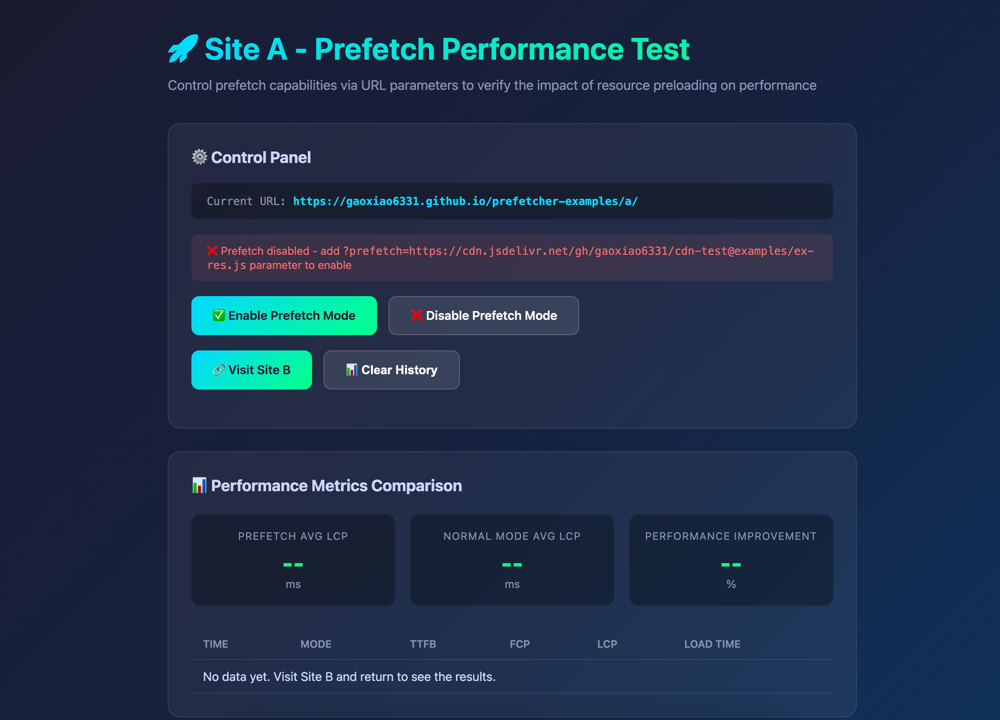
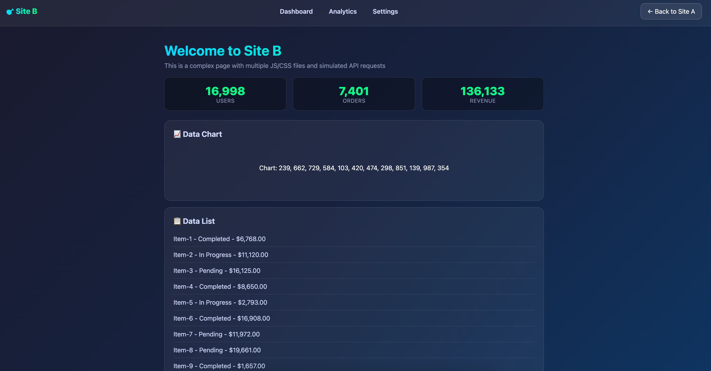

[这里](https://github.com/gaoxiao6331/prefetcher-examples)是使用AI生成的两个简单的DEMO项目，并部署在github page，用于验证预取策略的效果。其中，a项目是一个静态的html，会根据是否有prefetch参数来判断是否开启预取功能。b项目是一个基于react+rsbuild的项目，如果开启了预取功能，a会prefetch b项目的关键资源。




验证环境
macbook pro 2019 16寸 32GB
nodejs v20.18.1

执行验证脚本
```bash
cd script

# 生成关键资源列表
./res_gen.sh

# 执行验证脚本
node test-prefetch.js 20
```

验证结果


减少delay时间
